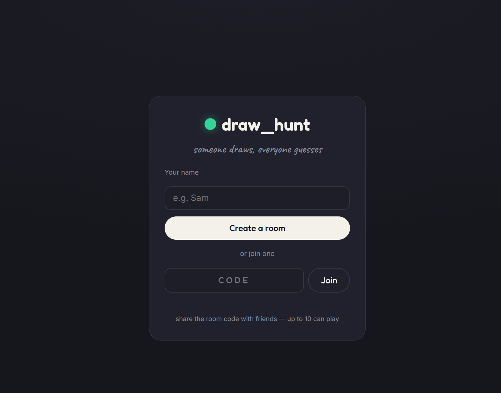

# DrawHunt — a real-time draw & guess game

A multiplayer draw_hunt game built with **Flask** and **Flask-SocketIO**.
One player draws a chosen word; everyone else races to guess it in chat. Rooms
hold up to 10 players and run for a configurable number of rounds.




## Features

- Create or join a room with a short 4-letter code (up to 10 players)
- Turn-based drawing with a shared HTML5 canvas (colors, brush sizes, eraser, undo, clear)
- Low-latency stroke relay: vector segments batched per animation frame, not images
- Live chat with server-side guess detection — a correct guess never leaks the word to others
- Full game loop: word choice (10s, auto-picks if you wait too long), drawer rotation, per-turn timer
- Progressive **hints**: letters reveal over time (~30% of the word, spread across the turn)
- Time-based scoring (faster guesses score more) with a drawer bonus, and a podium finish
- Survives refreshes and reconnects mid-game; host migrates if the host leaves

## Quick start (local)

Requires Python 3.10+ (3.12 recommended).

```bash
cd draw_hunt
python -m venv venv && source venv/bin/activate    # optional but recommended
pip install -r requirements.txt
python app.py
```

Open http://localhost:5000. To play solo-test, open a second browser window in
incognito (so it gets a different identity), create a room in one, copy the
code, and join from the other. You need at least 2 players to start.

## How to play

1. One player **creates a room** and shares the 4-letter code.
2. Others **join with the code** and a name. Everyone lands in a lobby.
3. The **host** sets rounds and seconds-per-turn, then starts the game.
4. Each turn, the drawer **picks one of three words** within 10 seconds (it
   auto-picks if they don't). They draw; everyone else types guesses in chat.
5. Guess correctly to score — sooner is worth more. The drawer earns a bonus
   based on how many players guess.
6. After every player has drawn each round, a **podium** shows the final scores.

## Configuration

All gameplay constants live in `config.py` (rounds, durations, scoring weights,
hint fraction, cleanup timings) — tune them in one place. Runtime settings come
from environment variables (see `.env.example`):

| Variable | Purpose | Default |
|---|---|---|
| `SECRET_KEY` | Signs Flask sessions — set a long random value in production | dev placeholder |
| `CORS_ORIGINS` | Allowed Socket.IO origins; set to your deployed URL in production | `*` |
| `PORT` | Port to bind (the host usually provides this) | `5000` |
| `FLASK_DEBUG` | `1` enables debug/reload locally | `0` |

## Deploying

This is a stateful WebSocket app, so it needs a host that keeps a **persistent
process** (not a serverless/static host like Vercel or Netlify). Render,
Railway, and Fly.io all work.

### The one rule that matters: a single worker

Room state lives in memory in **one process**, and gunicorn's load balancer has
no sticky sessions, so you must run exactly one worker:

```bash
gunicorn --worker-class eventlet -w 1 --bind 0.0.0.0:$PORT app:app
```

`-w 1` is non-negotiable. Running more workers would scatter players across
separate in-memory room registries. (Scaling beyond one process is possible but
requires a Redis message queue and a load balancer with sticky sessions — out of
scope for a ≤10-player game.)

### Render (Blueprint — easiest)

1. Push this folder to a GitHub repo.
2. In Render: **New → Blueprint**, select the repo. It reads `render.yaml`,
   which sets the build/start commands, a health check, and a generated
   `SECRET_KEY`.
3. After the first deploy, copy your service URL and (optionally) set
   `CORS_ORIGINS` to it in the service's Environment settings, then redeploy.

### Render (manual) / Railway / generic

- **Build:** `pip install -r requirements.txt`
- **Start:** `gunicorn --worker-class eventlet -w 1 --bind 0.0.0.0:$PORT app:app`
  (platforms that read a `Procfile`, like Railway, will pick it up automatically)
- Set `SECRET_KEY` (and ideally `CORS_ORIGINS`) as environment variables.

### Fly.io

`fly launch` will detect a Python app; accept the generated config but ensure the
process command is the gunicorn line above, then `fly deploy`. Fly keeps a small
always-on allowance, so it avoids the cold starts free Render services have.

### Free-tier behavior to expect

- Free web services **spin down after ~15 minutes** with no inbound traffic
  (HTTP *or* WebSocket). An active game keeps the service awake; an empty room
  does not. The next visitor triggers a **~1-minute cold start**.
- The filesystem is **ephemeral** — fine here, because all state is in memory and
  intentionally non-persistent (rooms vanish when empty anyway). There is no
  database, so nothing to lose.

## Architecture (brief)

```
Browser (canvas + Socket.IO)  <-- WebSocket -->  Flask-SocketIO (single process)
```

- `game/` — pure, testable domain logic: `Player`, `Room`, `RoomManager`,
  `scoring`, `words`. No networking here.
- `sockets/` — Socket.IO handlers split by concern: `connection`, `lobby`,
  `drawing`, `gameplay`, plus `director` (the per-game background task that runs
  the turn/round loop) and `common` helpers.
- `static/js/` — `canvas` (drawing engine), `board` (toolbar + draw relay),
  `chat`, `lobby` (room controller), `identity`.
- The server is the single source of truth: it broadcasts the full room state on
  every change and never sends the secret word to anyone but the drawer.

Players are keyed by a stable client-generated `user_id` (not the transient
socket id), which is what makes refresh and reconnect work seamlessly.

## Troubleshooting

- **"Eventlet is deprecated" warning on startup.** Harmless — eventlet still
  works and is the standard async worker for Flask-SocketIO. Two related notes:
  - `gunicorn` is pinned to `23.0.0` on purpose. **gunicorn 26 removed the
    bundled `eventlet`/`gevent` workers**, so `--worker-class eventlet` fails
    there with "Entry point not found." Don't bump gunicorn past 23 without
    also switching the async model.
  - If you want off eventlet entirely, Flask-SocketIO also supports the gevent
    worker (`gunicorn -k geventwebsocket.gunicorn.workers.GeventWebSocketWorker -w 1 app:app`)
    or the threaded worker with `simple-websocket`. Both require switching
    `async_mode` in `app.py`, removing the eventlet monkey-patch, and — for the
    threaded path — adding locks around shared room state (eventlet's
    cooperative scheduling currently makes that unnecessary).
- **Drawing/chat works locally but not when deployed.** Confirm your host allows
  WebSockets and that you're running the eventlet worker with `-w 1`. A plain
  sync worker blocks on the first WebSocket and the app appears frozen.
- **Players land in "different" empty rooms.** You're running more than one
  worker. Set `-w 1`.
- **First visitor waits ~1 minute.** That's the free-tier cold start, not a bug.

## Project structure

```
draw_hunt/
├── app.py              # entrypoint: Flask + SocketIO init, routes, handler registration
├── config.py           # all tunable constants + env-driven settings
├── requirements.txt
├── Procfile            # start command for Railway/Heroku-style hosts
├── render.yaml         # Render Blueprint
├── .env.example
├── game/               # domain logic (no networking)
│   ├── player.py  room.py  manager.py  scoring.py  words.py
├── sockets/            # Socket.IO handlers
│   ├── connection.py  lobby.py  drawing.py  gameplay.py  director.py  common.py
├── static/
│   ├── css/style.css
│   └── js/  identity.js  landing.js  lobby.js  canvas.js  board.js  chat.js
└── templates/  index.html  game.html
```