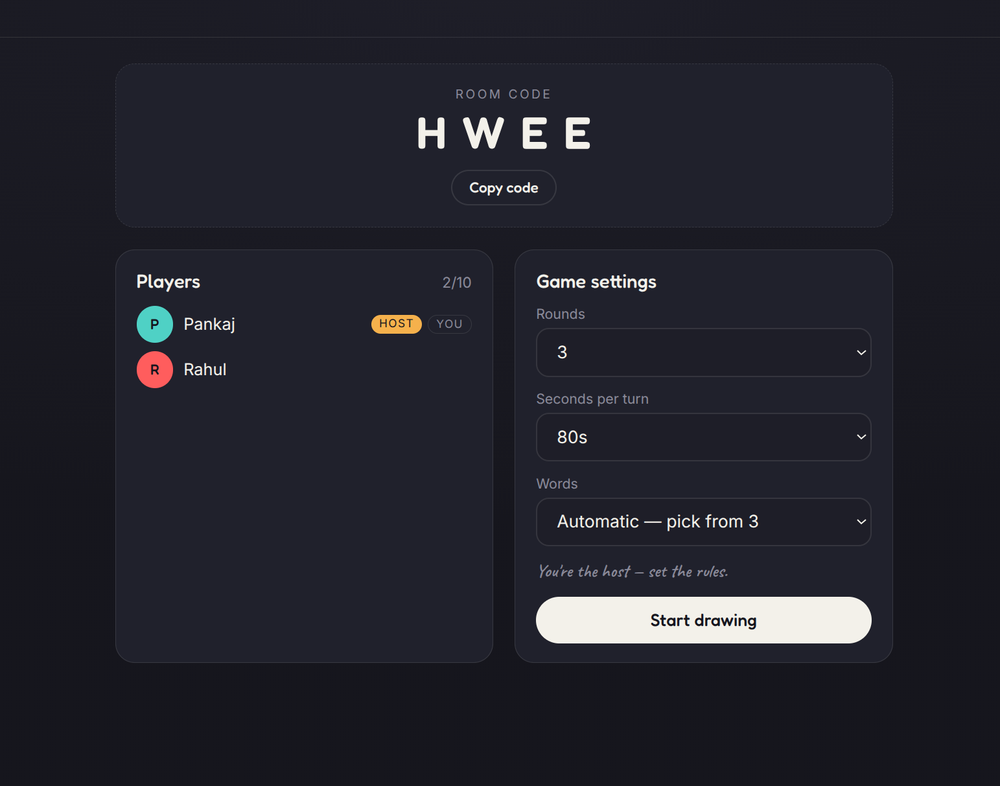

# 🎨 DrawHunt — Real-Time Multiplayer Draw & Guess Game

DrawHunt is a fast-paced, real-time multiplayer draw-and-guess game built on **Flask** and **Flask-SocketIO**. One player draws a chosen secret word on a shared canvas while everyone else races against the clock to crack the code in live chat. 

---

### 🚀 Experience the Game Live!

The game is deployed and ready to play right now. Gather a friend, open two tabs, and jump in!

[](https://draw-hunt.onrender.com/)

> **💡 Feedback & Contributions:** This project is actively evolving! If you explore the live app and encounter any bugs, have UX suggestions, or think of cool feature ideas, please open an **Issue** or submit a **Pull Request**. Your feedback helps make DrawHunt better!

---

## 📸 Gameplay Preview

| Welcome Lobby | Live Game Session |
| :---: | :---: |
|  |  |

---

## ✨ Features

* **Instant Rooms:** Create or join a custom lobby using a quick 4-letter room code (supports up to 10 simultaneous players).
* **Vector Canvas Engine:** Smooth, turn-based drawing utilizing a shared HTML5 canvas. Complete with customizable colors, adjustable brush sizes, an eraser, undo functionality, and quick-clear.
* **Low-Latency Performance:** Stroke data is batched and relayed via pure vector segments per animation frame, bypassing heavy image transfers entirely.
* **Smart Chat & Guess Detection:** Live chat with server-side processing. Correct guesses are intercepted instantly, meaning the secret word never leaks to other players.
* **Complete Game Loop:** Managed 10-second word choices (with auto-pick fallbacks), automated drawer rotation, and per-turn countdown timers.
* **Dynamic Letter Hints:** Progressive hints reveal letters over time (around 30% of the word) spaced evenly across the turn duration.
* **Competitive Scoring:** Time-based scoring rewarding faster guesses. Drawers receive scale bonuses based on how many players guessed correctly, leading up to an animated podium finish.
* **Robust Reconnections:** Players are bound to stable client-generated identities, ensuring they seamlessly survive accidental page refreshes mid-game. Lobbies feature active host-migration if the original creator drops.

---

## 🏗️ High-Level Project Structure

```text
draw_hunt/
├── app.py              # Application entrypoint (Flask + SocketIO orchestration)
├── config.py           # Single-source configuration (tunable constants + environment variables)
├── render.yaml         # Automated Render Blueprint deployment spec
├── Procfile            # Deployment routing instructions for platform runtimes
├── requirements.txt    # Application dependencies
├── game/               # Pure, decoupled domain & game logic (Networking-free)
│   ├── manager.py      # Global room state orchestration
│   ├── player.py       # Player profiles and identity tracking
│   ├── room.py         # Room lifecycles, rounds, and turn states
│   ├── scoring.py      # Time-sensitive point calculations
│   └── words.py        # Word banks and selector logic
├── sockets/            # Real-time WebSocket connection handling layers
│   ├── common.py       # Shared payload decorators & event exceptions
│   ├── director.py     # Background loop runner managing turns/clocks
│   └── [connection/drawing/gameplay/lobby].py  # Event-specific socket handlers
├── static/             # Client-side front-end engine
│   ├── css/            # UI styles and typography layout
│   └── js/             # Modular front-end controls (canvas mechanics, chat, socket listeners)
├── templates/          # Jinja2 views (Landing Page & Dynamic Game UI)
└── images/             # Visual assets and README documentation graphics
```

---

## 🛠️ Quick Start (Local Setup)

Requires Python 3.10 or higher (Python 3.12 is highly recommended).

1. **Clone the repository and jump in:**
   ```bash
   git clone [https://github.com/your-username/draw_hunt.git](https://github.com/your-username/draw_hunt.git)
   cd draw_hunt
   ```
2. **Spin up a virtual environment & install packages:**
   ```bash
   python -m venv venv
   source venv/bin/activate  # On Windows use: venv\Scripts\activate
   pip install -r requirements.txt
   ```
3. **Boot up the server:**
   ```bash
   python app.py
   ```
4. **Test it locally:** Open `http://localhost:5000`. To test multiplayer functionality solo, open a second browser window in **Incognito Mode** so it generates a separate player identity. Copy your 4-letter room code, join, and start the game!

---

## 🎮 How to Play

1. **Host a Room:** Click "Create Room", pick a nickname, and share the unique 4-letter room code.
2. **Gather Players:** Friends join using the room code. Everyone pops up instantly in the live lobby.
3. **Configure & Launch:** The host adjusts the number of rounds and turn duration, then clicks **Start**.
4. **Draw & Guess:** When it's your turn, pick 1 of 3 secret words within 10 seconds and start drawing. If you're guessing, watch the canvas closely and type your ideas directly into the live chat.
5. **Win Points:** The faster you guess, the more points you earn. Drawers score bonuses based on how clear their drawing was to others.
6. **The Podium:** Once everyone has completed their drawings for the designated rounds, the podium reveals the top 3 master artists.

---

## ⚙️ Configuration & Environment Settings

All gameplay dynamics (round limits, hint frequencies, weights) are isolated cleanly inside `config.py`. Runtime options are fed via environment variables:

| Variable | Purpose | Default / Development Value |
|---|---|---|
| `SECRET_KEY` | Secures Flask sessions (Override with a strong random string in production) | `dev placeholder` |
| `CORS_ORIGINS` | Protects Socket.IO entry origins (Set to your domain in production) | `*` |
| `PORT` | Networking port binding configuration | `5000` |
| `FLASK_DEBUG` | Enables hot-reloading and development stacks | `0` (Disabled) |

---

## 🌐 Production Deployment

Because DrawHunt is a stateful WebSocket application, it relies on a **persistent background process**. Serverless frameworks (like Vercel or Netlify) are incompatible. Render, Railway, or Fly.io are ideal choices.

### 🚨 The Non-Negotiable Rule: Single Worker Execution
Room state is registered entirely inside the system's in-memory engine. Standard WSGI load balancers don't have sticky sessions by default, meaning **you must limit your production configuration to exactly one worker process**:

```bash
gunicorn --worker-class eventlet -w 1 --bind 0.0.0.0:$PORT app:app
```
Using `-w 1` ensures your players stay grouped in the same room registry instead of getting split across conflicting memory processes.

### Deploying on Render (Blueprint Deployment)
1. Commit your codebase to your GitHub repository.
2. Navigate to Render, select **New → Blueprint**, and link your repository.
3. Render will immediately ingest your `render.yaml` profile, provision environment dependencies, inject a unique `SECRET_KEY`, and spin up the architecture automatically.

---

## 🧩 Architecture Snapshot

```
Browser UI (Canvas rendering + Socket.IO client)
                     ↕  [ Low-Latency WebSockets ]
Flask-SocketIO Engine (Single Process App Workspace)
```

* **Domain Segregation:** The `game/` engine remains completely ignorant of the transport network layer, facilitating easy unit testing.
* **Networking Hub:** The `sockets/` registry controls asynchronous user states, while `sockets/director.py` runs non-blocking background routines managing the central game clocks.
* **State-Stability:** Clients are tracked via unique client-side identifiers rather than ephemeral socket IDs, providing high resilience against dropping signals or intentional window refreshes.

---

## 🔍 Troubleshooting & Tech Nuances

* **Gunicorn Constraints:** The project pins `gunicorn==23.0.0` deliberately. Gunicorn versions 26+ stripped out bundled `eventlet` plugins, which causes unexpected startup exceptions if upgraded blindly.
* **Free-Tier Wakeups:** If hosted on Render's free tier, the web service will enter a sleeping state after 15 minutes of silence. The first visitor following a sleep window will encounter a **~1-minute cold start** while the instance spins back up.
* **Disjointed Lobbies:** If players join the exact same code but find themselves sitting in empty, isolated rooms, your production web server is running multiple workers. Double-check your setup to ensure `-w 1` is strictly enforced.